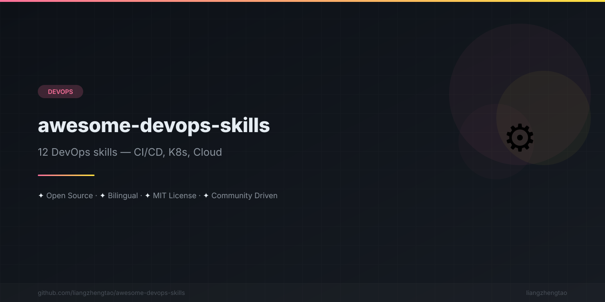

[English](README.md) | [中文](README.zh.md) | [日本語](README.ja.md) | [Français](README.fr.md) | [Español](README.es.md)

<div align="center">



</div>


# Awesome DevOps Skills

[](https://github.com/liangzhengtao/awesome-devops-skills/actions/workflows/ci.yml)
[](LICENSE)
[](https://awesome.re)
[](CONTRIBUTING.md)

---

> **Arrêtez les interventions d'urgence. 12 compétences IA pour automatiser votre infrastructure.**

Une collection soigneusement sélectionnée de compétences IA de production pour le DevOps et l'automatisation d'infrastructure. Chaque fichier de compétence est un module de connaissances autonome qu'un agent IA peut charger pour vous aider à construire, déployer, surveiller et exploiter des systèmes de production.

---

## Table des matières

- [Aperçu des compétences](#aperçu-des-compétences)
- [Démarrage rapide](#démarrage-rapide)
- [CI/CD](#cicd)
- [Conteneurisation](#conteneurisation)
- [Cloud](#cloud)
- [Surveillance](#surveillance)
- [Contribuer](#contribuer)
- [Voir aussi](#voir-aussi)

---

## Aperçu des compétences

| # | Catégorie | Compétence | Description |
|---|----------|-------|-------------|
| 1 | CI/CD | [GitHub Actions Avancé](skills/CI-CD/github-actions-advanced.md) | Builds matriciels, OIDC, workflows réutilisables, mise en cache |
| 2 | CI/CD | [GitLab CI/CD](skills/CI-CD/gitlab-cicd.md) | Runners, pipelines DAG, environnements, analyse de sécurité |
| 3 | CI/CD | [Stratégies de déploiement](skills/CI-CD/deployment-strategies.md) | Bleu-vert, canari, rolling, Argo Rollouts |
| 4 | Conteneurisation | [Docker en production](skills/容器化/docker-production.md) | Multi-stages, durcissement sécurité, optimisation d'images |
| 5 | Conteneurisation | [Kubernetes Essentiel](skills/容器化/kubernetes-essentials.md) | Deployments, RBAC, HPA, réseau, dépannage |
| 6 | Conteneurisation | [Helm Charts](skills/容器化/helm-charts.md) | Développement de charts, templating, tests, dépôts |
| 7 | Cloud | [AWS Essentiel](skills/云服务/aws-essentials.md) | IAM, VPC, ECS, RDS, S3, optimisation des coûts |
| 8 | Cloud | [Terraform IaC](skills/云服务/terraform-iac.md) | Modules, gestion d'état, workspaces, intégration CI/CD |
| 9 | Cloud | [Patterns Serverless](skills/云服务/serverless-patterns.md) | Lambda, API Gateway, Step Functions, EventBridge |
| 10 | Surveillance | [Prometheus + Grafana](skills/监控告警/prometheus-grafana.md) | Exportateurs, PromQL, tableaux de bord, alertes basées sur SLO |
| 11 | Surveillance | [Stack de journalisation](skills/监控告警/logging-stack.md) | ELK, Loki, Fluentd, Vector, LogQL, rétention |
| 12 | Surveillance | [Gestion d'incidents](skills/监控告警/incident-response.md) | Astreinte, runbooks, post-mortems, escalade |

---

## Démarrage rapide

### Pour les utilisateurs d'agents IA

1. **Choisissez une compétence** dans le tableau ci-dessus selon votre tâche
2. **Chargez le fichier de compétence** dans le contexte de votre agent IA
3. **Appliquez les modèles** — chaque compétence contient du code de production

### Pour les développeurs

```bash
# Cloner le dépôt
git clone https://github.com/liangzhengtao/awesome-devops-skills.git
cd awesome-devops-skills

# Parcourir les compétences
ls skills/*/

# Utiliser dans votre projet
cp skills/CI-CD/github-actions-advanced.md .github/workflows/
```

### Structure d'un fichier de compétence

Chaque compétence suit un format cohérent :

```
┌─────────────────────────────────┐
│  Quand l'utiliser               │  ← Conditions de déclenchement claires
│  Architecture                   │  ← Diagrammes ASCII
│  Modèles de code               │  ← YAML/HCL/Dockerfile
│  Patterns éprouvés             │  ← Recommandations validées
│  Écueils                        │  ← Erreurs courantes à éviter
└─────────────────────────────────┘
```

---

## CI/CD

### [GitHub Actions Avancé](skills/CI-CD/github-actions-advanced.md)
Patterns avancés pour GitHub Actions : builds matriciels, authentification OIDC, workflows réutilisables, stratégies de cache, runners auto-hébergés et automatisation de publication sémantique.

### [GitLab CI/CD](skills/CI-CD/gitlab-cicd.md)
Pipelines GitLab de production : optimisation DAG, runners à mise à l'échelle automatique, Review Apps, modèles d'analyse de sécurité et déploiements multi-environnements.

### [Stratégies de déploiement](skills/CI-CD/deployment-strategies.md)
Patterns de déploiement sans interruption : bleu-vert avec Argo Rollouts, canari avec répartition de trafic et analyse automatique, mises à jour progressives avec health checks.

---

## Conteneurisation

### [Docker en production](skills/容器化/docker-production.md)
Patterns Docker de production : multi-stages (images de 45 Mo), conteneurs non-root, analyse de sécurité avec Trivy, builds multi-architectures et Docker Compose pour la production.

### [Kubernetes Essentiel](skills/容器化/kubernetes-essentials.md)
Patterns K8s de production : déploiements avec répartition topologique, RBAC au moindre privilège, HPA avec métriques personnalisées, NetworkPolicy et commandes de dépannage complètes.

### [Helm Charts](skills/容器化/helm-charts.md)
Patterns Helm éprouvés : structure modulaire de charts, helpers de template, values multi-environnements, déploiements `--atomic`, test de charts et publication sur registre OCI.

---

## Cloud

### [AWS Essentiel](skills/云服务/aws-essentials.md)
Architecture AWS de production : VPC multi-AZ, IAM OIDC au moindre privilège, services ECS Fargate, Aurora Serverless, sécurité S3 et optimisation des coûts avec budgets.

### [Terraform IaC](skills/云服务/terraform-iac.md)
Terraform à grande échelle : modules réutilisables, état distant avec verrouillage, séparation des environnements, CI/CD avec plan/apply, Terratest et stratégies de migration d'état.

### [Patterns Serverless](skills/云服务/serverless-patterns.md)
Serverless piloté par événements : Lambda avec API Gateway, workflows Step Functions, règles EventBridge, DynamoDB single-table, optimisation du démarrage à froid et modèles SAM.

---

## Surveillance

### [Prometheus + Grafana](skills/监控告警/prometheus-grafana.md)
Stack d'observabilité complète : configuration Prometheus, recording rules, alertes basées sur SLO, tableaux de bord Grafana avec variables, routage Alertmanager et Thanos pour le stockage long terme.

### [Stack de journalisation](skills/监控告警/logging-stack.md)
Journalisation centralisée : déploiement Grafana Loki, expédition de logs Fluent Bit/Vector, requêtes LogQL, politiques ILM Elasticsearch, journalisation structurée et alertes basées sur les logs.

### [Gestion d'incidents](skills/监控告警/incident-response.md)
Gestion d'incidents : politiques d'escalade PagerDuty, modèles de runbook, format de post-mortem, définitions de sévérité, modèles de communication et suivi du budget d'erreur SLO.

---

## Contribuer

Les contributions sont les bienvenues ! Voir [CONTRIBUTING.md](CONTRIBUTING.md) pour les directives.

**Comment contribuer :**

1. Forker le dépôt
2. Créer une branche de fonctionnalité
3. Ajouter ou améliorer un fichier de compétence
4. Soumettre une Pull Request

**Exigences pour les compétences :**
- 150+ lignes par fichier
- Inclure les 5 sections obligatoires
- Modèles de code de production

---

## Voir aussi

Autres collections awesome utiles :

- **[awesome-selfhosted](https://github.com/awesome-selfhosted/awesome-selfhosted)** — Logiciels auto-hébergés
- **[awesome-kubernetes](https://github.com/ramitsurana/awesome-kubernetes)** — Ressources Kubernetes
- **[awesome-docker](https://github.com/veggiemonk/awesome-docker)** — Écosystème Docker
- **[awesome-terraform](https://github.com/shuaibiyy/awesome-terraform)** — Modules et outils Terraform
- **[awesome-prometheus](https://github.com/roaldnefs/awesome-prometheus)** — Écosystème Prometheus
- **[awesome-aws](https://github.com/donnemartin/awesome-aws)** — Ressources AWS
- **[awesome-sre](https://github.com/dastergon/awesome-sre)** — Ingénierie de fiabilité de site
- **[awesome-helm](https://github.com/cdwv/awesome-helm)** — Charts et outils Helm
- **[awesome-pipeline](https://github.com/pditommaso/awesome-pipeline)** — Outils de pipeline CI/CD
- **[awesome-grafana](https://github.com/iamchucky/awesome-grafana)** — Tableaux de bord et plugins Grafana
- **[awesome-incidents](https://github.com/jonah-jones/awesome-incidents)** — Ressources de gestion d'incidents
- **[awesome-serverless](https://github.com/anaibol/awesome-serverless)** — Frameworks et outils Serverless

---

## Licence

[MIT License](LICENSE) - Copyright (c) 2026 liangzhengtao

---

<p align="center">
  Conçu avec soin pour la communauté DevOps<br>
  <a href="https://github.com/liangzhengtao/awesome-devops-skills">Donnez une étoile</a> si vous le trouvez utile
</p>
